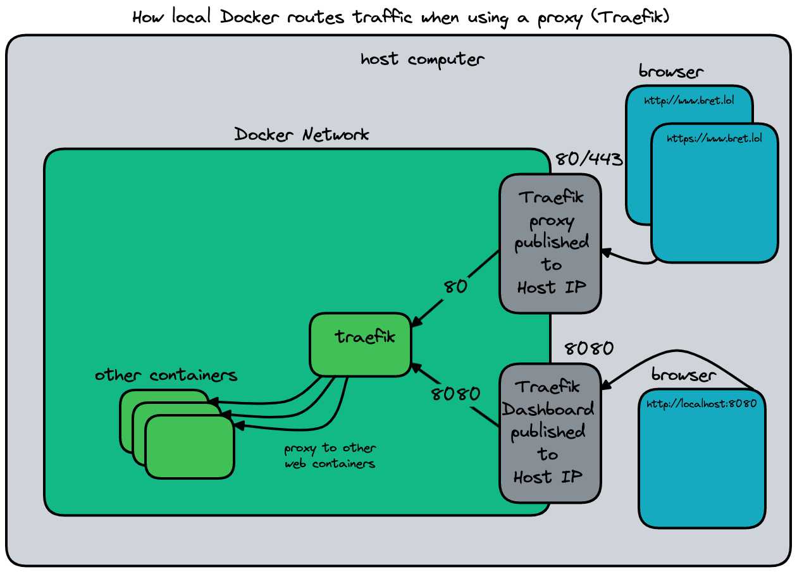
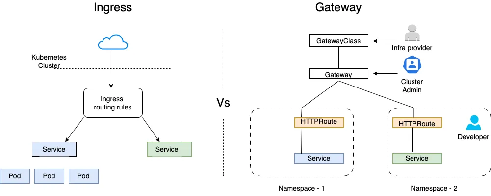
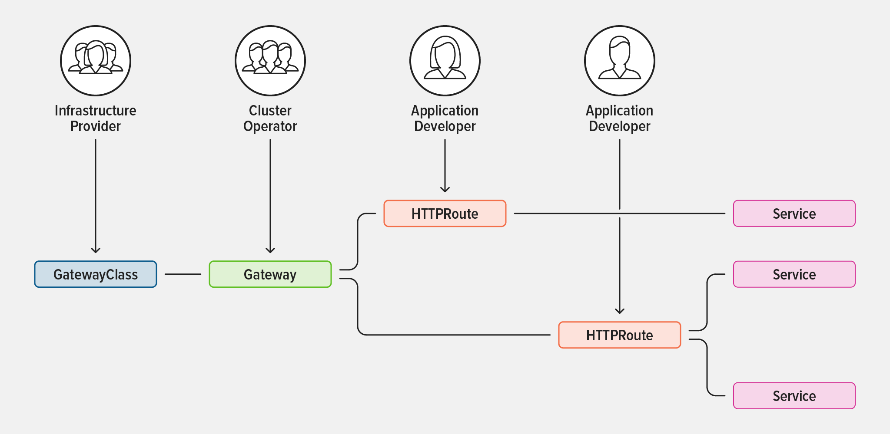

# Docker Desktop

Provides **Docker**, **Kubernetes** runtime and CLI **tools** for local development.

> NOTE: you need either **Docker Desktop** ([free for personal use](https://www.docker.com/pricing/))  or **Rancher Desktop** (free). pick one only

**[Docker Desktop](https://www.docker.com/products/docker-desktop/)** Container Management and Kubernetes on the Desktop. 

Download and install the latest binary for your platform from [www.docker.com](https://www.docker.com/products/docker-desktop/).
Unpack and move `Docker Desktop.app` to `/Applications`  

It includes:

1. docker
2. kubernetes (*you have to explicitly enable kubernetes in settings if you need it*)

## Configuration

It is recommended assign:

- 8 GB or above memory
- minimum 4 CPU
- Enable **[kubernetes](https://docs.docker.com/desktop/kubernetes/)** (optional)

## Addons

List of optional addons for kubernetes running in **Docker Desktop**

### Helm (optional)

Install [Helm](../devops/helm.md) package manager for Kubernetes. unlike Rancher-Desktop, Docker-Desktop doesnot include **Helm** by default. 

```shell
brew install helm
```

### Traefik with Compose (optional)




### Traefik with Kubernetes (optional)

Refer [Step 4: Use it on the TLS Store in values.yaml file for this Helm Chart](https://github.com/traefik/traefik-helm-chart/blob/master/EXAMPLES.md#provide-default-certificate-with-cert-manager-and-cloudflare-dns)

[Run Traefik with Kubernetes in Docker Desktop](https://doc.traefik.io/traefik/getting-started/install-traefik/)

Install and configure Traefik Proxy to use the Gateway API

**Gateway API** is not installed on Kubernetes clusters by default.  





Deploy Gateway API CRD's::
```shell
# install CRDs if already not installed. 
#  kubectl get crd gateways.gateway.networking.k8s.io &> /dev/null || \
#   { kubectl kustomize "github.com/kubernetes-sigs/gateway-api/config/crd?ref=v1.0.0" | kubectl apply -f -; }

 kubectl get crd gateways.gateway.networking.k8s.io &> /dev/null || \
  { kubectl kustomize "github.com/kubernetes-sigs/gateway-api/config/crd?ref=v0.4.0" | kubectl apply -f -; }

# customresourcedefinition.apiextensions.k8s.io/gatewayclasses.gateway.networking.k8s.io created
# customresourcedefinition.apiextensions.k8s.io/gateways.gateway.networking.k8s.io created
# customresourcedefinition.apiextensions.k8s.io/httproutes.gateway.networking.k8s.io created
# customresourcedefinition.apiextensions.k8s.io/referencegrants.gateway.networking.k8s.io created

# DANGER: Remove the Gateway API CRDs if they are no longer needed:
kubectl kustomize "github.com/kubernetes-sigs/gateway-api/config/crd?ref=v0.4.0" | kubectl delete -f -
```

Deploying Traefik Proxy v3.0
```shell
helm repo add traefik https://traefik.github.io/charts
helm repo update

# create k8 namespace for traefik
kubectl create ns traefik

# This will install and start traefik in your local cluster
helm install traefik \
traefik/traefik \
--namespace traefik \
--set image.tag=v3.0 \
--set ingressRoute.dashboard.entryPoints="{web,websecure}" \
--set experimental.kubernetesGateway.enabled=true \
--wait

# in case of you want to rollback above installation
helm uninstall traefik  --namespace traefik
```
verify

```bash
kubectl get all -n traefik
kubectl describe svc traefik --namespace traefik | grep Ingress | awk '{print $3}'
```
The service named `service/traefik` should get a EXTERNAL-IP of `localhost` which can be seen in the list printed above

This means that you can access the Traefik load balancer by navigating to http://localhost/dashboard/#/ in your browser.  

```shell
# kubectl port-forward $(kubectl get pods --selector "app.kubernetes.io/name=traefik" -n traefik --output=name) -n traefik 9000:9000
open http://traefik.localhost/dashboard/#/
open https://traefik.localhost/dashboard/#/
```

## DevOps tools

Install optional DevOps tools for SREs

```shell
brew install kubectx # to switch kube context, namespace quickly. https://github.com/ahmetb/kubectx
brew install kubens # to switch kube  quickly
brew install kubernetes-helm # package manager for Kubernetes
brew install kustomize # Kubernetes native configuration management
brew install stefanprodan/tap/kustomizer # package manager for distributing Kubernetes configuration as OCI artifacts
brew install derailed/k9s/k9s # Manage Your k8s In Style!
brew install istioctl # Istio configuration command line utility
brew install dive # A tool for exploring a docker image, layer contents, and discovering ways to shrink the size of your Docker/OCI image
brew install crane # A tool for interacting with remote images and registries.
brew tap anchore/syft && brew install syft # SBOM tool
brew install cosign # Container Signing, Verification and Storage in an OCI registry.
brew install skaffold # build and deploy docker images
go install sigs.k8s.io/bom/cmd/bom@latest # Create SPDX-compliant Bill of Materials
```

## Usage

```shell
docker info
docker version
docker stats
docker context list
# to use tools like dive, you may need to switch context to docker-desktop
docker context use docker-desktop
docker top CONTAINER
docker volume ls
docker network ls
```

```shell
# List builder instances
docker buildx ls
# inspect current builder instance
docker buildx inspect
docker buildx imagetools inspect <MULTI_PLATFORM_IMAGE>
docker buildx imagetools inspect --raw nginx:alpine | jq
```

### Images

```shell
docker build .
docker tag
docker tag SOURCE_IMAGE[:TAG] TARGET_IMAGE[:TAG]

docker images

docker login -u aaaa -p bbb
# Log in to your repository, I am using GitHub container registry
export GITHUB_PACKAGES_TOKEN=ghp_YOUR_TOKEN
docker login -u {github_username} -p {[token](https://github.com/settings/tokens)} ghcr.io

# inspect image
docker inspect redislabs/redismod:edge
docker inspect --format "{{.Architecture}}" redislabs/redismod:edge

# Remove one or more images
docker rmi docker.vectorized.io/vectorized/redpanda:v21.11.2

# default from docker.io
docker pull jwsy/jade-shooter:v1.1

docker images | grep jwsy
docker run -d -p 8080:80 jwsy/jade-shooter:v1.1
docker run -d -p 80:80 --name=nginx --restart=always nginx

# `e2a5` is output from above command
docker exec -it e2a5 sh
docker images
# save load
docker save -o local_jwsy_jade-shooter_v1.2.tar
docker load -i local_jwsy_jade-shooter_v1.2.tar
```

#### Encrypt image layers with [ocicrypt](https://github.com/containerd/nerdctl/blob/master/docs/ocicrypt.md)

```shell
openssl genrsa -out mykey.pem
openssl rsa -in mykey.pem -pubout -out mypubkey.pem
docker image encrypt --recipient=jwe:mypubkey.pem --platform=linux/amd64,linux/arm64 foo example.com/foo:encrypted
docker push example.com/foo:encrypted
```

#### Sign and Verify Container Image with [cosign](https://github.com/containerd/nerdctl/blob/master/docs/cosign.md) tool

```shell
# Generate a key-pair: cosign.key and cosign.pub
cosign generate-key-pair

# Export your COSIGN_PASSWORD to prevent CLI prompting
export COSIGN_PASSWORD=$COSIGN_PASSWORD
```

Sign the container image while pushing:

```shell
# Sign the image with Keyless mode
docker push --sign=cosign devopps/hello-world

# Sign the image and store the signature in the registry
docker push --sign=cosign --cosign-key cosign.key devopps/hello-world
```

Verify the container image while pulling:

```shell
# Verify the image with Keyless mode
docker pull --verify=cosign devopps/hello-world
```

```shell
# push first
docker push -ghcr.io/xmlking/grpc-starter-kit/base:v0.2.0
# then sigh and verify
COSIGN_EXPERIMENTAL=1 cosign sign ghcr.io/xmlking/grpc-starter-kit/base:v0.2.0
COSIGN_EXPERIMENTAL=1 cosign verify ghcr.io/xmlking/grpc-starter-kit/base:v0.2.0
```

#### Generate and upload the SBOM

We will use the **syft** to generate the SBOM and once its generated we will attach to image using **cosign**

```shell
# Let’s first generate the SBOM
syft packages ghcr.io/junaid18183/sampleapp:0.0.1 -o spdx  > latest.spdx
cosign attach sbom --sbom latest.spdx ghcr.io/xmlking/sampleapp:0.0.1
```

### Dive

To explore docker image layers:

```bash
dive spring-service:1.6.5-SNAPSHOT
```

### Compose

```shell
docker compose -f infra/redis.yml up redis
docker compose -f infra/redpanda.yml up redpanda
docker compose -f infra/redpanda.yml logs
docker compose -f infra/redis.yml down
docker compose -f infra/redpanda.yml down
# this will stop redpanda and remove all volumes
docker compose -f infra/redpanda.yml down -v

docker compose -f infra/redpanda.yml ps
# name of the container can be found from output of above command
docker exec -it infra_redpanda_1 /bin/bash
docker exec -it infra_redpanda_1 rpk version
docker exec -it infra_redpanda_1 rpk topic list
docker exec -it infra_redpanda_1 rpk cluster info

# verify if docker `compose` getting correctly resolved application config from .env
docker compose config # implicitly set `env-file` to `.env`
docker compose --env-file .env --env-file .secrets config  # explicitly set `env-file` to `.env` and `.secrets`

# ssh to container (if needed to debug)
docker compose exec -it redpanda \
rpk topic consume twitch_chat --brokers=localhost:9092
# Or
docker exec -it redpanda-1 \
rpk topic produce twitch_chat --brokers=localhost:9092
docker exec -it redpanda-1 \
rpk topic consume twitch_chat --brokers=localhost:9092
```

### traefik

How to expose **traefik** v2 dashboard?

create `dashboard.yaml` file

```shell
cat << 'EOF' > dashboard.yaml
apiVersion: traefik.containo.us/v1alpha1
kind: IngressRoute
metadata:
  name: dashboard
spec:
  entryPoints:
    - web
  routes:
    - match: Host(`traefik.localhost`) && (PathPrefix(`/dashboard`) || PathPrefix(`/api`))
      kind: Rule
      services:
        - name: api@internal
          kind: TraefikService
EOF
```

```shell
kubectl -n kube-system apply -f dashboard.yaml
```

open dashboard in your favorite browser and **don't forget the second slash**

```shell
open http://traefik.localhost/dashboard/#/
```

## Reference

StevenACoffman's [Docker Best Practices and Antipatterns](https://gist.github.com/StevenACoffman/41fee08e8782b411a4a26b9700ad7af5)

- [Signing images and creating SBOM using cosign](https://www.ijuned.com/Signing-images-and-creating-SBOM-using-cosign/)
- A collection of useful things you can do with `crane`
  is [here](https://github.com/google/go-containerregistry/blob/main/cmd/crane/recipes.md)
- [Compendium of Kubernetes Application Deployment Tools](https://medium.com/@KarlKFI/compendium-of-kubernetes-application-deployment-tools-80a828c91e8f)
- Make Docker container respond to SIGTERM and SIGINT for gracefully shutdown
  - [Zombie reaping problem](https://www.back2code.me/2020/02/zombie-processes/)
  - [Docker and the PID 1 zombie reaping problem](https://blog.phusion.nl/2015/01/20/docker-and-the-pid-1-zombie-reaping-problem/)
- [Faster Multi-Platform Builds: Dockerfile Cross-Compilation Guide](https://www.docker.com/blog/faster-multi-platform-builds-dockerfile-cross-compilation-guide/)
- [Docker Compose: Fragments, Configs top-level element, Secrets top-level element](https://github.com/compose-spec/compose-spec/blob/master/spec.md#configs-top-level-element)
- [Kubernetes Ingress Vs Gateway API](https://medium.com/google-cloud/kubernetes-ingress-vs-gateway-api-647ee233693d)
- [Kubernetes & Traefik with local Wildcard certificates](https://hugo.md/post/kubernetes-and-traefik/)